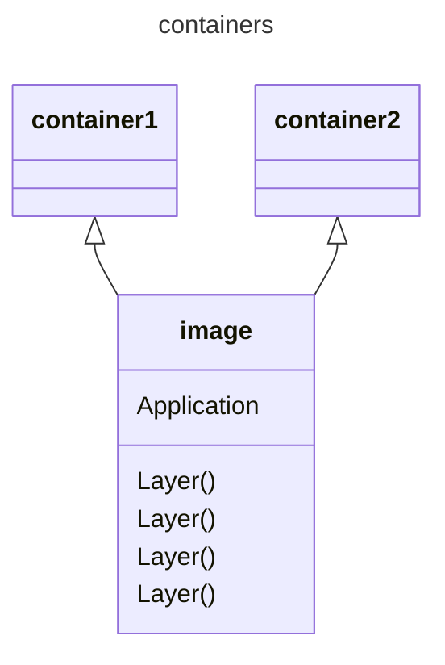

# Containers

## What is a container


A **container** is a *mini virtual machine* **(not really)** used for packaging an application/microservice will all of its prerequisites (runtimes, other dependencies and os/distribution)

### Architecture

A **container image** is built on a *layer technology*



### Advantages

- Standarization
  - A container has a standard interface **Container Runtime Interface (CRI)** which means it can run everywhere as long as a *container runtime* is present
- Packaging
  - An application inside a container *ships* with all of its dependencies, so everything will work no matter where it is run
- Isolation
  - An application running inside a container has its own environment and cannot ruin other applications environments (nor have its own env. ruined by others). Resources can also be limited based on containers
- Security
  - Based on the isolation, an application can be limited to what it can see and touch
- Speed
  - A container is much faster, and requires less resources, than a *virtual machine* or regular server

## Running a container

### Installing a runtime and build engine

If only a *container runtime* is needed the most used *runtime* now i **containerd** (used by *kubernetes*). However in this module we will also need to have a *build engine* available so that we can build our own images, and will therefore use **docker buildx**

```bash

sudo apt update
sudo apt install docker-buildx -y
sudo usermod -aG docker $USER
newgrp docker

```

### From standard image

We will now get a *standard image* **nginx** a small *web server* and spin up two instances *containers* of the same image

```bash
## check the local image repository
docker images

## Get the nginx image
docker pull nginx

## Run an instance of the image with a published endpoint (detached)
docker run --publish 5000:80 --name myfirstcontainer -d nginx

```

You can access the default web page on your localhost port 5000 now

```bash

curl localhost:5000

```

Let's execute a command in the newly created container / mini-vm

```bash

docker exec -it myfirstcontainer ls -l

```

We can also take control of a *bash* session

```bash

docker exec -it myfirstcontainer bash

```

Let's find all the .html files in the file system to see where the *nginx* web server's default path is

```bash

find / -type f -name *.html 2>/dev/null

```

As you can see it is in the **/usr/share/nginx/html** folder
Go there and change the default *html* page to something else

```bash

cd /usr/share/nginx/html
echo '<html><body><h1>Hello students</h1></body></html>' > index.html


exit

```

Now try to call the *localhost:5000* again

You should see the new html appear

## Create own container image

We will create our own *.NET ASPNET CORE WebApi* and build a **container image** hosting the api

- First let's check how many images there already are in your local docker image repo

```bash

docker images

```

[Back to top](#demo)


#### Install .NET SDK if needed

```bash

sudo add-apt-repository ppa:dotnet/backports

sudo apt-get update && \
  sudo apt-get install -y dotnet-sdk-10.0

```

[Back to top](#demo)

#### Create a webapi project

- Create the project and add a *GET* method /version that returns **1.0**

```bash

dotnet new webapi -o demoapi
cd demoapi/
sed -i '/app\.MapGet("\/weatherforecast/i app.MapGet("/version", () => { return "1.0"; });' Program.cs

```

### Create a Dockerfile

- A **Dockerfile** is a *recipe* for creating a *container image* with the application running inside

- The file will contains the following

```dockerfile

FROM mcr.microsoft.com/dotnet/sdk:10.0 AS build
WORKDIR /source

COPY *.csproj .
RUN dotnet restore

COPY . .

RUN dotnet publish -c release -o /app --no-restore

FROM mcr.microsoft.com/dotnet/aspnet:10.0
WORKDIR /app
COPY --from=build /app ./
ENTRYPOINT ["dotnet", "demoapi.dll"]

```

- We will also need a *.dockerignore* file the contains the folders: *obj* and *bin* since we don't want them copied into the container image if the project has already been build locally before building the container

```dockerfile

bin
obj

```

- Here are bash commands for creating both these files, remember to be in the /demoapi folder

```bash

cat<<EOF>>Dockerfile
FROM mcr.microsoft.com/dotnet/sdk:10.0 AS build
WORKDIR /source

COPY *.csproj .
RUN dotnet restore

COPY . .

RUN dotnet publish -c release -o /app --no-restore

FROM mcr.microsoft.com/dotnet/aspnet:10.0
WORKDIR /app
COPY --from=build /app ./
ENTRYPOINT ["dotnet", "demoapi.dll"]
EOF

cat<<EOF>>.dockerignore
bin
obj
EOF


```

### Build the container image

- To build the *container image* you supply both a container **image name** and **version**. The name **Dockerfile** is the default *recipe name* so we don't need to specify that, and the **dot (.)** specifies that the *Dockerfile* is located in the current folder.

```bash

docker build -t demoapi:1.0 .

```

- Check your docker images again, you might see a couple of images, but pay attention to the image demoapi with *TAG* 1.0


### Create a container from image

- We will now create a container from our *demoapi* **container image**

```bash

docker run -p 6010:8080 --name firstdemoapi -d demoapi:1.0

```

### List containers (both running and exited)

```bash

docker ps -a --format json | jq '{Name: .Names, State: .State, Net: .Networks,Ports: .Ports}'

```

- As just listed, our container *firstdemoapi* is running locally now and listening on port *6010* the reason we chose port *8080* as the target port inside the container is because as of .NET 8 the default port for a *webapi* when containerized is *8080*


- Call the version method on the api

```bash

curl localhost:6010/version

```

### Create a new version

- Change version 1.0 to 1.1 inside the code

```bash

sed -i 's/1.0/1.1/g' Program.cs
docker build -t demoapi:1.1 .

```

- Check docker images, you should now have both a *1.0* and *1.1* version of **demoapi**

- create a new container with the *1.1* version, leave the original version *1.0* container running
   - NOTE: the new container will need a new port number since all containers running in Docker reside on *localhost* 

```bash

docker run -p 6011:8080 --name seconddemoapi -d demoapi:1.1

```

- List all running containers, you should have both *firstdemoapi* and *seconddemoapi* listening on seperate ports

- call both *1.0* and *1.1* version and verify that we are now hosting two containers with different versions
