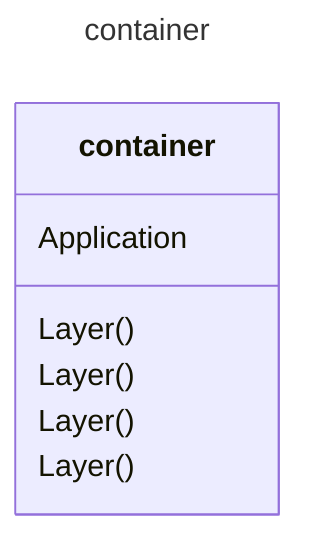

# Containers

## What is a container

A **container** is a *mini virtual machine* **(not really)** used for packaging an application/microservice will all of its prerequisites (runtimes, other dependencies and os/distribution)

### Architecture

A **container image** is built on a *layer technology*

### Advantages

- Standarization
  - A container has a standard interface **Container Runtime Interface (CRI)** which means it can run everywhere as long as a *container runtime* is present
- Packaging
  - An application inside a container *ships* with all of its dependencies, so 
- Isolation
  - An application running inside a container has its own environment and cannot ruin other applications environments (nor have its own env. ruined by others). Resources can also be limited based on containers

