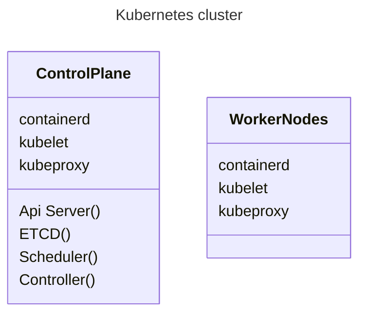

# Kubernetes Cluster

## Infrastructure

```mermaid
---
title: Kubernetes cluster
---
classDiagram

    ControlPlane : Api Server()
    ControlPlane : ETCD ()
    ControlPlane : Scheduler ()
    ControlPlane : Controller ()
    ControlPlane : containerd
    ControlPlane : kubelet
    ControlPlane : kubeproxy


    WorkerNodes: containerd
    WorkerNodes: kubelet
    WorkerNodes: kubeproxy

```