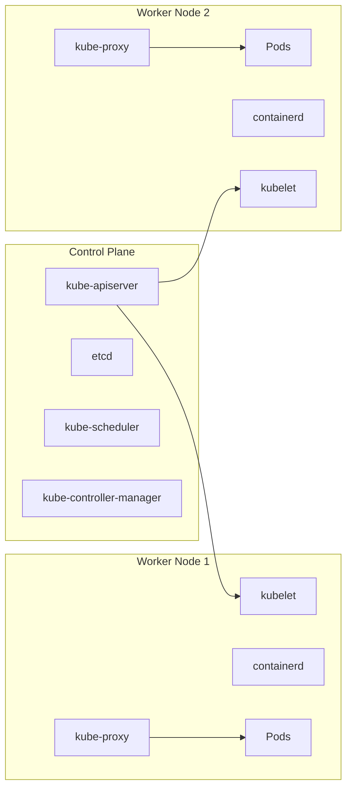

### DEMO


#### Microservices

- Loosely coupled services
- fine-grained
- Develop/Deploy Services independently
- Improve modularity, scalability, and adaptability


- More Complexitity (Cannot test everything in a monolit)


- Microservices are services within a single application, and in general not to be shared across applications
   - BUT: this is too strict of a rule and there are different opinions about this
   - Don't mistake a microservice with a "multi-purpose" application / api like 
        - Entra
        - The companies own "Billing Service" used by many applications


[Back to top](#demo)


#### Docker / Containers

- There doesn't have to be a 1-1 between containers and microservices!
    - You can work with microservices without use of containers
	- You can use containers to "host" a monolit
	
- Mini VM
  - Fast deployment
  - Ships with all prereq/Dependencies
  - Easy rollback
  - Resource Control
  - Scalability/Security/Network control   (Probably needs an Orchestrator like Kubernetes)
  
 
- Docker Desktop (runs on Linux, can run in "Windows" (Not really) with WSL (Windows Subsystem for Linux)


#### Install windows

```powershell

wsl --install
wsl --update

winget install Docker.DockerDesktop


```


[Back to top](#demo)

#### Install linux

```bash

wsl --install
wsl --update

wsl --install Ubuntu-24.04

```

[Back to top](#demo)

open/close terminal  -> You should now be able to open a new tab with Ubuntu 

```bash

sudo apt update
sudo apt upgrade -y

sudo apt install docker.io -y

sudo usermod -aG docker $USER
newgrp docker

```

[Back to top](#demo)


#### First container / "Mini" VM

```bash

docker run -p 5000:80 --name myfirstcontainer -d nginx

```

Since *nginx* is a webserver you can access the default web page on your localhost port 5000 now

```bash

curl localhost:5000

```

[Back to top](#demo)


Let's execute a command in the newly created container / mini-vm

```bash

docker exec -it myfirstcontainer ls -l

```

We can also take control of a *bash* session

```bash

docker exec -it myfirstcontainer bash


```

[Back to top](#demo)


Let's find all the .html files in the file system to see where the *nginx* web server's default path is

```bash

find / -type f -name *.html 2>/dev/null

```

As you can see it is in the **/usr/share/nginx/html** folder
Go there and change the default *html* page to something else

```bash

cd /usr/share/nginx/html
echo '<html><body><h1>Hello students</h1></body></html>' > index.html


exit

```

[Back to top](#demo)

Now try to call the *localhost:5000* again

You should see the new html appear

You might even be able to browse this page from a browser in your windows environment

If your *Linux* environment does not forward to your localhost in your Windows env. You can try the following

- In Linux get all the eth0 ip address 

```bash

hostname -I

```
It's usually the first ip address to appear

try that ip address with the port 5000 in your browser  (like 172.30.211.202:5000)

[Back to top](#demo)


### Create own API

We will create our own *.NET ASPNET CORE WebApi* and build a **container image** hosting the api

- First let's check how many images there already are in your local docker image repo

```bash

docker images

```

[Back to top](#demo)


#### Install .NET SDK if needed

```bash

sudo add-apt-repository ppa:dotnet/backports

sudo apt-get update && \
  sudo apt-get install -y dotnet-sdk-9.0

```

[Back to top](#demo)

#### Create a webapi project

- Create the project and add a *GET* method /version that returns **1.0**

```bash

dotnet new webapi -o demoapi
cd demoapi/
sed -i '/app\.MapGet("\/weatherforecast/i app.MapGet("/version", () => { return "1.0"; });' Program.cs

```

[Back to top](#demo)

#### Create a Dockerfile

- A **Dockerfile** is a *recipe* for creating a *container image* with the application running inside

- The file will contains the following

```dockerfile

FROM mcr.microsoft.com/dotnet/sdk:9.0 AS build
WORKDIR /source

COPY *.csproj .
RUN dotnet restore

COPY . .

RUN dotnet publish -c release -o /app --no-restore

FROM mcr.microsoft.com/dotnet/aspnet:9.0
WORKDIR /app
COPY --from=build /app ./
ENTRYPOINT ["dotnet", "demoapi.dll"]


```

[Back to top](#demo)

- We will also need a *.dockerignore* file the contains the folders: *obj* and *bin* since we don't want them copied into the container image if the project has already been build locally before building the container

```dockerfile

bin
obj

```

[Back to top](#demo)

- Here are bash commands for creating both these files, remember to be in the /demoapi folder

```bash

cat<<EOF>>Dockerfile
FROM mcr.microsoft.com/dotnet/sdk:9.0 AS build
WORKDIR /source

COPY *.csproj .
RUN dotnet restore

COPY . .

RUN dotnet publish -c release -o /app --no-restore

FROM mcr.microsoft.com/dotnet/aspnet:9.0
WORKDIR /app
COPY --from=build /app ./
ENTRYPOINT ["dotnet", "demoapi.dll"]
EOF

cat<<EOF>>.dockerignore
bin
obj
EOF


```

[Back to top](#demo)


#### Build the container image

- To build the *container image* you supply it with both a container image name and version. Remember to be located in the same folder as your **Dockerfile** The last dot (.) indicates that the *recipe* is named the default name of **Dockerfile** and is located in the same folder as you're executing from

```bash

docker build -t demoapi:1.0 .

```

- Check your docker images again, you might see a couple of images, but pay attention to the image demoapi with *TAG* 1.0


[Back to top](#demo)

##### Create a container from image

- We will now create a container from our *demoapi* **container image**

```bash

docker run -p 6010:8080 --name firstdemoapi -d demoapi:1.0

```

#### List containers (both running and exited)

```bash

docker ps -a --format json | jq '{Name: .Names, State: .State, Net: .Networks,Ports: .Ports}'

```
[Back to top](#demo)


- As just listed, our container *firstdemoapi* is running locally now and listening on port *6010* the reason we chose port *8080* as the target port inside the container is because as of .NET 8 the default port for a *webapi* when containerized is *8080*


- Call the version method on the api

```bash

curl localhost:6010/version

```

- Try in your browser as well, remember localhost might not work, then use the ip address retrieved earlier


[Back to top](#demo)


#### Create a new version

- Change version 1.0 to 1.1 inside the code

```bash

sed -i 's/1.0/1.1/g' Program.cs
docker build -t demoapi:1.1 .

```

- Check docker images, you should now have both a *1.0* and *1.1* version of **demoapi**

- create a new container with the *1.1* version, leave the original version *1.0* container running
   - NOTE: the new container will need a new port number since all containers running in Docker reside on *localhost* 

```bash

docker run -p 6011:8080 --name seconddemoapi -d demoapi:1.1

```

- List all running containers, you should have both *firstdemoapi* and *seconddemoapi* listening on seperate ports

- call both *1.0* and *1.1* version and verify that we are now hosting two containers with different versions

[Back to top](#demo)

### Run ElasticSearch

- Elastic search already has an image in *Docker Hub* so we call *pull* it and start containers with the image as we see fit

   - NOTE: You do not have to pull the image before running a container instance of an image, if the image requsted in a run is not present locally it will be pulled automatically

```bash

docker pull elasticsearch:9.1.5

docker run \
    -p 9200:9200 \
	--name elastic1 \
	-e "discovery.type=single-node" \
	-e "xpack.security.enabled=false" \
	-d elasticsearch:9.1.5


```

[Back to top](#demo)

- Notice the two **-e** (Environment Variables) this is used to set *Environment Variables* in the container instance we are starting


- Your elastic search might take a minutte to be ready to serve requests even if the status is *running*
- You can follow a *container instance* **STDOUT** and **STDERR** logging with this command

```bash

docker logs elastic1 -f

```

[Back to top](#demo)

- You now have an *elasticsearch* instance running on *localhost:9200* try calling it

```bash

curl localhost:9200

```

- Should give you a result like this:

```json

{
  "name" : "115c70cb30ed",
  "cluster_name" : "docker-cluster",
  "cluster_uuid" : "bH-yPYwWThaczAgjQ0452g",
  "version" : {
    "number" : "9.1.5",
    "build_flavor" : "default",
    "build_type" : "docker",
    "build_hash" : "90ee222e7e0136dd8ddbb34015538f3a00c129b7",
    "build_date" : "2025-10-02T22:07:12.966975992Z",
    "build_snapshot" : false,
    "lucene_version" : "10.2.2",
    "minimum_wire_compatibility_version" : "8.19.0",
    "minimum_index_compatibility_version" : "8.0.0"
  },
  "tagline" : "You Know, for Search"
}

```

[Back to top](#demo)

#### Volumes

- Per default, container instances are *stateless* and should now write any significant data to their local *folder structure*. Many apis are truly *stateless* and are therefore a nice fit for containerization

- However: If we try to containerize a *stateful* service like **elastic search** we need to control the data written to the various files, since they cannot/should not reside inside the container. 
    - NOTE: A container instance is unstable and might *die* and a new container instance should be able to be created, substituting the original container without any data loss.

- We will now show what the consequences of a *stateful* container can be

- Create an index in your *elastic search* container

```bash

curl localhost:9200/importantindex -X PUT

```

- Verify that the index is now present

```bash

curl localhost:9200/_cat/indices


```

[Back to top](#demo)

- You should see your "importantindex"

- Now let's "crash" the container and spin it up again


```bash

docker rm elastic1 -f

docker run \
    -p 9200:9200 \
	--name elastic1 \
	-e "discovery.type=single-node" \
	-e "xpack.security.enabled=false" \
	-d elasticsearch:9.1.5


```

[Back to top](#demo)

- Remember it might that a while before the container is "ready to serve", use *docker logs elastic1 -f* to see logging while initialzing

- Now try listing the indices again

- The index is gone: In other words **WE HAVE LOST ALL DATA**

#### Create an Instance with volume mount

- Remove the elastic search container instance again

```bash

docker rm elastic1 -f

```

[Back to top](#demo)

- Go to your working directory (do NOT do the following inside the *demoapi* folder)

- Create local folders that can hold our *elastic search* data
   - NOTE: normally we will put this on a File Server, NFS-drive, Cloud Drive etc. and not just a local computer

```bash

mkdir dockerdata
sudo mkdir -p dockerdata/elastic1
sudo chown -R 1000:0 dockerdata/elastic1
sudo chmod -R 770 dockerdata/elastic1

```

- Now run the container again, this time mounting the folder */usr/share/elasticsearch/data* inside the container instance to our local *dockerdata/elastic1* folder

```bash
CURRENTFOLDER=$(pwd)

docker run \
    -p 9200:9200 \
	--name elastic1 \
	-e "discovery.type=single-node" \
	-e "xpack.security.enabled=false" \
	-v $CURRENTFOLDER/dockerdata/elastic1:/usr/share/elasticsearch/data  \
	-d elasticsearch:9.1.5


```

[Back to top](#demo)

- List the local folder and notice that the container has written several folders/files to the local folder

```bash

ls dockerdata/elastic1/ -l

```

- Now create an index again
- Verify that the index is there
- remove the container and create it again 
- Verify that the index is still there (persisted)

```bash

curl localhost:9200/importantindex -X PUT

curl localhost:9200/_cat/indices

docker rm elastic1 -f

docker run \
    -p 9200:9200 \
	--name elastic1 \
	-e "discovery.type=single-node" \
	-e "xpack.security.enabled=false" \
	-v $CURRENTFOLDER/dockerdata/elastic1:/usr/share/elasticsearch/data  \
	-d elasticsearch:9.1.5

### Again: might take a little while before ready to servce

curl localhost:9200/_cat/indices

```

[Back to top](#demo)

### Network

- Docker do have some network capabilities, but not nearly as advanced as *Kubernetes*

- Let's create a new virtual network in Docker and add two web servers on the network and examine how they communicate with each other internally using *ip addresses* and *DNS*

```bash

docker network create webservernet --subnet 172.65.0.0/24 --ip-range 172.65.0.0/24

docker run \
   -p 7500:80 \
   --name netwebserver1 \
   --network webservernet \
   -d nginx


docker run \
   -p 7510:80 \
   --name netwebserver2 \
   --network webservernet \
   -d nginx
   


```

- List your running container instances again

```bash

docker ps -a --format json | jq '{Name: .Names, State: .State, Net: .Networks,Ports: .Ports}'

```

- Notice that we have the two webservers now: *netwebserver1* and *netwebserver2*

- We can communicate with them using localhost:7500 or 7510 but since they are on the same *virtual network* in *Docker* they can also communicate internally with either *ip addresses* or *fqdn*

- Let's first alter *netwebserver1*'s default page

```bash

docker exec -it netwebserver1 sh -c "echo '<html><body><h1>Hello students</h1></body></html>' > /usr/share/nginx/html/index.html"


```

[Back to top](#demo)

- If you call localhost:7500 you should now see your custom web page

- Now let's call *netwebserver1* from **within** *netwebserver2*

- Bash into *netwebserver2*

```bash

docker exec -it netwebserver2 bash

### Inside get your ip address

hostname -I

```

- The local ip address for *netwebserver2* will be something like 172.65.0.3

- We will now install *nmap* and scan the subnet
   - NOTE: nmap is a **hacker tool** for both *white-hats* and *black-hats* please only use inside this virtual network we are doing now, and NOT for anything else, unless you know what you are doing

```bash

apt update
apt install nmap -y


```
[Back to top](#demo)

- Now with my ip adress being 172.65.0.3 and the virtual network we created was a 172.65.0.0/24 CIDR range, let's scan the entire subnet for servers that respond and try to get their DNS names

```bash

nmap -sn 172.65.0.0/24


```

- The scan should detect our *netwebserver1* and its ip address, with something like this

```
Nmap scan report for netwebserver1.webservernet (172.65.0.2)

```

- Now the default DNS registration for *Docker* is as follows: 
  - [container instance name].[subnet name]

- If our case, the *subnet name* can be eliminated since we are on the same subnet
- So calling the following from within *netwebserver2* should give us the custom web page on *netwebserver1* created earlier

```bash

curl 172.65.0.2 ## Or what ip address nmap showed for netwebserver1

curl netwebserver1


```


[Back to top](#demo)

##### Clean up network demo

```bash

docker rm netwebserver1 -f
docker rm netwebserver2 -f

docker network rm webservernet


```

[Back to top](#demo)


## Kubernetes

### Update ubuntu

```bash

sudo apt update && sudo apt upgrade -y

```

### Install Docker (if needed)

```bash

sudo apt install docker.io -y

sudo usermod -aG docker $USER
newgrp docker


```

### Install kubectl 

```bash

### install kubectl 

curl -LO "https://dl.k8s.io/release/$(curl -L -s https://dl.k8s.io/release/stable.txt)/bin/linux/amd64/kubectl"
sudo install -o root -g root -m 0755 kubectl /usr/local/bin/kubectl

chmod +x kubectl
mkdir -p ~/.local/bin
mv ./kubectl ~/.local/bin/kubectl

### kubectl completion

sudo apt-get install -y bash-completion
echo "source <(kubectl completion bash)" >> ~/.bashrc
source ~/.bashrc


```

### Install kind

```bash

curl -Lo ./kind https://kind.sigs.k8s.io/dl/v0.31.0/kind-linux-amd64
chmod +x ./kind
sudo mv ./kind /usr/local/bin/kind


```

[Back to top](#demo)

### Create Kubernetes cluster

```bash

kind create cluster --name mycluster

```

[Back to top](#demo)

### Create first test app

```bash

### Create namespace
kubectl create namespace test

### Run a pod/Container in the namespace
kubectl run nginx --image=nginx --namespace test

### List all pods in the namespace
kubectl get pods --output wide --namespace test

### Set test namespace as default
kubectl config set-context --current --namespace test

### Validate default namespace
kubectl config get-contexts

### List all pods in namespace (without namespace specification)
kubectl get pods --output wide


```

[Back to top](#demo)


#### Debug pod

```bash

kubectl create namespace debug
kubectl run debug --image=nginx --namespace debug

### list folders/files in debug pod
kubectl exec -it debug --namespace debug -- ls -l

### bash into debug pod

kubectl exec -it debug --namespace debug -- bash

### Try and curl the nginx container in the test namespace

curl ........

### Exit out of the debug pod
exit

### Alter the nginx container with new webpage
kubectl exec -it nginx -- sh -c "echo '<html>Hello</html>' > /usr/share/nginx/html/index.html"

### Now go into debug pod again and curl, you should now see the new page

```

[Back to top](#demo)

#### Using manifest files 

##### Create file

> Create file pod.yaml in an appropriate folder

```yaml
apiVersion: v1
kind: Pod
metadata: 
  name: nginx2
spec:
  containers:
    - name: nginx2-container
      image: nginx

```

### Apply manifest
```bash

kubectl apply --filename pod.yaml

```

[Back to top](#demo)

### Deployments

There are 3 types of *kubernetes controllers* 
- DaemonSet (Special cases, more later)
- StatefulSet (Special cases, more later)
- ReplicaSet (Used to control and ensure x number of pods running at all time, *is possible*)

We will be looking at **ReplicaSet** now. However, replicasets are the only *controller* that is never deployed
as a stand-alone controller, because a **ReplicaSet** is *immutable* when it comes to *image versions* and are therefore now capable of rolling out a new deployment of a new version of an image type.

To control this we always deploy a **Deployment** that controls the **ReplicaSet** and that can make a new **ReplicaSet** with a new image version and gracefully un-deploy the old one.

#### Cleanup existing deployment

```bash

### Using manifest file to remove everything again
kubectl delete --filename pod.yaml
### Manually delete the pod we created to begin with, without the use of manifest files
kubectl delete pod nginx

```
Please note: when removing these pods the namespace is completely empty. In other words at the movement we do not have any controllers to ensure that up and running of our pods. 
A **Deployment/ReplicaSet** will fix this

- Create a deployment.yaml file

```yaml
apiVersion: apps/v1
kind: Deployment
metadata:
  name: nginx-deployment
spec:
  selector:
    matchLabels:
      app: nginx
  template:
    metadata:
      labels:
        app: nginx
    spec:
      containers:
        - name: nginx-container
          image: nginx

```

- Apply the manifest

```bash
kubectl apply --filename deployment.yaml
```

- Verify the pods/deployment/replicaset

```bash
kubectl get all
```

- Now let's kill the pods again like before (replace name with correct name from your environment)
```bash
kubectl delete pod nginx-deployment-77b4f5b649-lnbm6
```

- List all pods again and notice that a new pod was created immediately because the **ReplicaSet** has a *desired state* of 1 and it will make sure, if possible, that the *current state* is always equal to the *desired state*, so once it saw that the *current state* was down to 0, it started a new pod.

- Let's try to scale *desired state* up

```bash
kubectl scale deployment nginx-deployment --replicas 4
```

- List pods and verify that now 4 pods are running

- Take a look at the *ip addresses* of the pods

```bash
kubectl get pods --output wide
```

- Go into the *debug pod* and curl some of the addresses, notice that each of them are responding


[Back to top](#demo)

### Services

Services are a *Load Balancer* in front of a *Deployment* (a number of identical pods)
All pods with an entry-point (this practically means all deployments) will also have a *Service* in front of them.

- Append this at the end of your *deployment.yaml*

```yaml
          image: nginx
---
apiVersion: v1
kind: Service
metadata:
  name: nginx-service
spec:
  selector:
    app: nginx
  ports:
    - port: 80
      targetPort: 80
```

- Re-apply your *deployment.yaml*

```bash
kubectl apply --filename deployment.yaml

```

- Notice the output

```
deployment.apps/nginx-deployment unchanged
service/nginx-service created
```
- Unchanged means that the manifest/desired state for the deployment *nginx-deployment* was identical to the actual state and therefore nothing changed
- Created means that the service *nginx-service* was not in *kubernetes* before and therefore was created
- Configured means that the artifact is already deployed in *kubernetes* but changes has been made in the manifest and therefore it has been altered


- Now get all again and notice that we now have a service with it's own *ip address*

- Go into the *debug pod* and curl the service address (exit again)

- Notice that the *load balancer/service* hits one of the 4 pods, we don't know which one and don't care

- Check out that the service has all 4 pods in its *endpoints*

```bash
### View all pods with ip adresses
kubectl get pods --output wide
### View the service's endpoints
kubectl describe service nginx-service
### Here you will see Endpoints: and 3 of the endpoints with an indication that there are more
### Scale down to 2 replicas
kubectl scale deployment nginx-deployment --replicas 2
### View pods again
### Now describe service again and notice that the service only have 2 endpoints now

```

- So think of the service as a *Load Balancer* that will detect automatically if more of less pods are available

##### Service DNS

- In practice we never want to call an ip address from a pod/container to another pod/service. Services comes with out-of-the-box DNS registration as follows:

```
SERVICE_NAME[.NAMESPACE][.svc.cluster.local]
```
Notice that *namespace* is optional and only needs to be specified if calling from a pod output the namespace of the service
Notice that the *domain* is also optional and may differ for various *kubernetes clusters*

- Go into the debug pod (which resides in ANOTHER namespace than our service)

```bash
kubectl exec -it debug --namespace debug -- bash

### Now try to curl just the service name (this won't work since we are not in the same namespace)
curl nginx-service
### Now append the namespace and it should work
curl nginx-service.test
```


[Back to top](#demo)


## Logging

- First let's try and log (and follow) one of our nginx pods (name will differ)

```bash
kubectl logs nginx-deployment-77b4f5b649-f78gs -f
```

- Open another terminal go into your debug pod and curl the service

```bash
kubectl exec -it --namespace debug debug -- bash


curl nginx-service.test

```

- Notice that not all calls are logged since we have two pods and we are calling a load-balancer. So approx. 50% of the calls will go to the one pod we were monitoring

- Let's monitor all the pods in the **ReplicaSet** by using *labels* instead. Exit the existing logging

```bash
kubectl logs -l app=nginx -f
```
- Now you should see all calls when calling the *service* in the *debug pod*

- In most cases we don't care about which pod/container is being hit, but if you need that information, run log like this

```bash
kubectl logs -l app=nginx --prefix=true -f
```
- This will set the *pod name* in front of each *log line*

[Back to top](#demo)

## Infrastructure





[Back to top](#demo)

